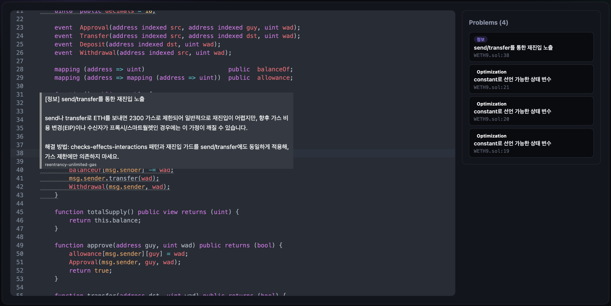

# SA — Smart Contract Auditor

Web3 스마트컨트랙트 정적분석 도구입니다. 리포트 한 장을 던져주는 대신, **소스 코드
위에 취약점을 VSCode Problems 패널처럼 인라인으로 표기**해서 감사자가 "어디가
왜 취약한지"를 코드 컨텍스트 안에서 바로 파악할 수 있도록 돕습니다.

```
[컨트랙트 주소 또는 .sol 파일] → [Slither 정적분석] → [인라인 코드 뷰어 + Markdown 리포트]
```

Slither가 찾아낸 finding을 정적 지식베이스(`data/detector_explanations.json`,
101개 detector 100% 커버)로 사람이 읽기 쉽게 정리합니다. **판단은 하지 않습니다** —
Slither가 찾은 것을 그대로, 다만 이해하기 쉽게 정리할 뿐입니다.



*온체인 주소(WETH9)를 입력하면 Slither 분석을 거쳐 코드 뷰어로 이어집니다. 취약한
라인에 밑줄/gutter 표기가 붙고, hover하면 설명과 해결 방법이 뜹니다. 오른쪽 Problems
패널에서 항목을 클릭하면 해당 코드로 스크롤됩니다.*

## 주요 기능

- **인라인 코드 뷰어** — CodeMirror 6 기반입니다. gutter 점/밑줄로 취약점 위치를
  표시하고, hover 시 설명·해결법 팝업을 보여주며, Problems 패널에서 클릭하면
  해당 코드로 스크롤됩니다.
- **온체인 주소 입력** — Etherscan API로 검증된 소스를 조회합니다. 프록시
  컨트랙트는 구현 컨트랙트까지 자동으로 따라가 실제 로직을 분석 대상으로 삼습니다.
- **Markdown 리포트** — 코드 뷰어와 같은 데이터로 만든 다운로드 가능한 부가 산출물입니다.
- **멀티 유저 웹 UI** — 로그인 없는 익명 세션, 세션+IP 레이트리밋, job 큐 기반
  백그라운드 분석을 제공합니다. 여러 사용자가 동시에 서로 다른 컨트랙트를
  분석해도 결과가 섞이지 않습니다.

## 아키텍처에서 눈여겨볼 점

실제로 부딪히고 고친 문제들 위주로 몇 가지만 짚어보겠습니다.

- **solc 버전 동시성** — 웹 백엔드는 서로 다른 pragma 버전의 컨트랙트를
  멀티스레드로 동시에 분석합니다. `solc-select use`로 전역 버전을 바꾸는 방식은
  이 상황에서 레이스 컨디션이 되므로, 대신 `solc-select install`만 하고
  `--solc <경로>`로 slither에 직접 바이너리를 지정하는 방식으로 바꿨습니다.
  버전별 `threading.Lock`으로 "같은 버전 동시 첫 설치" 레이스만 별도로 막습니다.
- **신뢰할 수 없는 입력에 대한 자원 제한** — 익명 사용자가 올린 컨트랙트를
  분석하는 subprocess에 CPU/메모리 상한을 겁니다. 표준적인 `preexec_fn` +
  `resource.setrlimit` 방식은 멀티스레드 프로세스에서 fork 이후 데드락 위험이
  있어(Python 공식 문서 경고) 대신 POSIX 셸의 `ulimit`으로 명령을 감싸고 `exec`으로
  치환하는 방식을 썼습니다.
- **재시작/다중 프로세스에도 살아남는 레이트리밋** — 처음엔 인메모리 슬라이딩
  윈도우였는데, 서버를 재시작하면 카운터가 리셋되는 문제가 있었습니다. Redis 같은
  새 인프라를 추가하는 대신 이미 있는 SQLite job DB에 테이블 하나를 추가해서
  신규 의존성 없이 재시작 생존과 다중 프로세스 공유를 모두 해결했습니다.
- **결과 캐싱** — 같은 주소나 같은 내용의 파일을 재분석하면 Etherscan 재조회와
  Slither 재실행을 건너뜁니다(TTL 6시간, 프록시 업그레이드 가능성 때문에 보수적으로
  설정했습니다). 실측 0.56초 → 0.07초입니다.

## 알려진 한계

- 패키지 스타일 import(`@openzeppelin/...`)는 remapping을 지원하지 않아 컴파일이
  실패할 수 있습니다.
- 로컬 파일 업로드는 단일 파일만 지원합니다(온체인 주소는 import 그래프 전체를 지원합니다).
- 프록시 해석은 1홉만 따라갑니다.
- Slither 자체가 놓친 이슈(예: 접근 제어가 아예 없는 함수)는 잡지 못합니다 — 이건
  의도된 트레이드오프이며, LLM 판단 레이어를 붙일 명분으로 `docs/future/`에
  남겨두었습니다.

## 빠른 시작

```bash
pip install -e ".[dev]"

# solc 컴파일러 (Apple Silicon Mac)
brew tap ethereum/ethereum && brew install solidity

# 로컬 파일 분석
python -m auditor.cli tests/fixtures/contracts/vulnerable_vault.sol

# 온체인 주소 분석 (.env에 ETHERSCAN_API_KEY 필요, 무료 발급)
cp .env.example .env
python -m auditor.cli 0x1234...
```

결과는 `reports/<컨트랙트명>.report.md`(사람이 읽는 리포트)와
`reports/<컨트랙트명>.findings.json`(코드 뷰어가 쓰는 구조화된 데이터)에 저장됩니다.

## 웹 UI로 실행

```bash
pip install -e ".[dev,web]"
cd frontend && npm install && cd ..

./scripts/dev.sh   # 백엔드(:8000)+프론트엔드(:5173)를 한 번에 실행, Ctrl+C로 둘 다 종료
```

브라우저에서 http://localhost:5173 을 엽니다. 두 서버를 각자 다른 터미널에서 따로
띄우고 싶으시면 `CLAUDE.md`의 "웹 UI로" 섹션을 참고해 주세요.

## 기술 스택

**백엔드**: Python · FastAPI · Slither · solc-select · SQLite
**프론트엔드**: React · TypeScript · Vite · CodeMirror 6
**테스트**: pytest 126개 (단위 테스트 + 실제 Slither를 돌리는 e2e 테스트 포함)

## 프로젝트 구조

`CLAUDE.md`의 "디렉토리 구조" 섹션을 참고해 주세요.
